# Curso de PostgreSQL Aplicado a Ciencia de Datos

- [Curso de PostgreSQL Aplicado a Ciencia de Datos](#curso-de-postgresql-aplicado-a-ciencia-de-datos)
  - [Modulo 1 Introducion a las Bases de Datos](#modulo-1-introducion-a-las-bases-de-datos)
    - [Clase 1 Introduccion y Bienvenida al Curso](#clase-1-introduccion-y-bienvenida-al-curso)
    - [Clase 2 Importacion de los datos para el proyecto](#clase-2-importacion-de-los-datos-para-el-proyecto)
      - [Paso 1: ingresa a PgAdmin](#paso-1-ingresa-a-pgadmin)
      - [Paso 2: Crea la base de datos](#paso-2-crea-la-base-de-datos)
      - [Paso 3: Configura la restauracion](#paso-3-configura-la-restauracion)
      - [Paso 3: Importa desde archivo](#paso-3-importa-desde-archivo)
      - [Paso 4: Verifica que las tablas fueron creadas](#paso-4-verifica-que-las-tablas-fueron-creadas)
    - [Clase 3 Breve historia de las bases de datos](#clase-3-breve-historia-de-las-bases-de-datos)
    - [Clase 4 Puntos fuertes de las bases de datos relacionales](#clase-4-puntos-fuertes-de-las-bases-de-datos-relacionales)
    - [Clase 5 Conceptos importantes de las bases de datos relacionales](#clase-5-conceptos-importantes-de-las-bases-de-datos-relacionales)
    - [Clase 6 Principales sentencias SQL](#clase-6-principales-sentencias-sql)
  - [Modulo 2 Ciencia de Datos](#modulo-2-ciencia-de-datos)
    - [Clase 7 Que es la ciencia de datos](#clase-7-que-es-la-ciencia-de-datos)
    - [Clase 8 Aplicacion de la ciencia de datos](#clase-8-aplicacion-de-la-ciencia-de-datos)
    - [Clase 9 Equipos orientados a datos](#clase-9-equipos-orientados-a-datos)
    - [Clase 10 Data science vs Machine Learning](#clase-10-data-science-vs-machine-learning)
  - [Modulo 3 Particularidades de PostgreSQL](#modulo-3-particularidades-de-postgresql)
    - [Clase 11 Diferencias entre otros manejadores y PostgreSQL](#clase-11-diferencias-entre-otros-manejadores-y-postgresql)
    - [Clase 12 Conoce los superpoderes de PLPGSQL](#clase-12-conoce-los-superpoderes-de-plpgsql)
    - [Clase 13 PLPGSQL: Stored procedures](#clase-13-plpgsql-stored-procedures)
    - [Clase 14 PLPGSQL: conteo, registro y triggers](#clase-14-plpgsql-conteo-registro-y-triggers)
    - [Clase 15 PLPGSQL: Aplicado a data science](#clase-15-plpgsql-aplicado-a-data-science)
    - [Clase 16 Integración con otros lenguajes](#clase-16-integración-con-otros-lenguajes)
      - [Conectores](#conectores)
      - [PL/pgSQL](#plpgsql)
      - [Otros lenguajes](#otros-lenguajes)
      - [C](#c)
      - [PL/Tcl](#pltcl)
      - [PL/Perl](#plperl)
      - [PL/Python](#plpython)
    - [Clase 17 Tipos de Datos Personalizados](#clase-17-tipos-de-datos-personalizados)
  - [Modulo 4 Casos Practicos](#modulo-4-casos-practicos)
    - [Clase 18 Explicación de la estructura de la base de datos de ejemplo](#clase-18-explicación-de-la-estructura-de-la-base-de-datos-de-ejemplo)
    - [Clase 19 Agregacion de datos](#clase-19-agregacion-de-datos)
    - [Clase 20 Pensando en la presentacion](#clase-20-pensando-en-la-presentacion)
    - [Clase 21 Trabajando con objetos](#clase-21-trabajando-con-objetos)
    - [Clase 22 Agregando objetos](#clase-22-agregando-objetos)
    - [Clase 23 Common table expressions](#clase-23-common-table-expressions)
    - [Clase 24 Window functions](#clase-24-window-functions)
    - [Clase 25 Particiones](#clase-25-particiones)
  - [Modulo 5 Platzi movies dashboard](#modulo-5-platzi-movies-dashboard)
    - [Clase 26 Presentación del proyecto](#clase-26-presentación-del-proyecto)
    - [Clase 27 Top 10](#clase-27-top-10)
    - [Clase 28 Actualizando precios](#clase-28-actualizando-precios)
    - [Clase 29 Usando rank y percent rank](#clase-29-usando-rank-y-percent-rank)
      - [Percentile Rank](#percentile-rank)
      - [Dense Rank](#dense-rank)
    - [Clase 30 Ordenando datos geograficos](#clase-30-ordenando-datos-geograficos)
    - [Clase 31 Datos en el tiempo](#clase-31-datos-en-el-tiempo)
    - [Clase 32 Visualizando datos con Tableau](#clase-32-visualizando-datos-con-tableau)
  - [Modulo 6 Siguientes pasos](#modulo-6-siguientes-pasos)
    - [Clase 33 Que sigue](#clase-33-que-sigue)

## Modulo 1 Introducion a las Bases de Datos

### Clase 1 Introduccion y Bienvenida al Curso

Bienvenida por parte del profesor, recomendaciones tomar el curso de fundamentos de bases de datos y el curso de Introduccion a Postgres

### Clase 2 Importacion de los datos para el proyecto

Es un proceso simple, sin embargo, para iniciar es necesario que cumplas con dos dependencias:

- La primera es haber instalado PostgreSQL y su set de herramientas en tu Sistema Operativo.

- La segunda es haber instalado PgAdmin 4 para que puedas interactuar de manera gráfica con la base de datos.

- Asegúrate de que el usuario postgresql se encuentra configurado y con todos los permisos.

Para conocer los detalles de la instalación de las anteriores dependencias, por favor visita el Curso de PostgreSQL donde es abordado a detalle. En este tutorial de importación asumimos que se encuentra correctamente configurado.

#### Paso 1: ingresa a PgAdmin

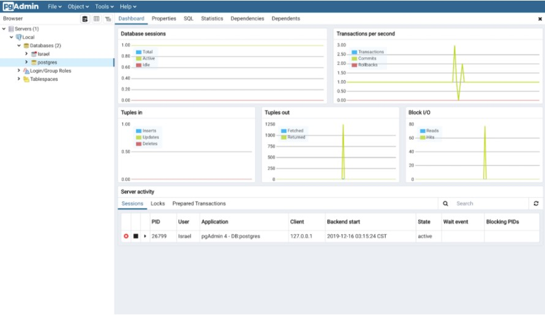

#### Paso 2: Crea la base de datos

Selecciona el elemento Databases del menú izquierdo, da click derecho y selecciona la opción Create > Database.

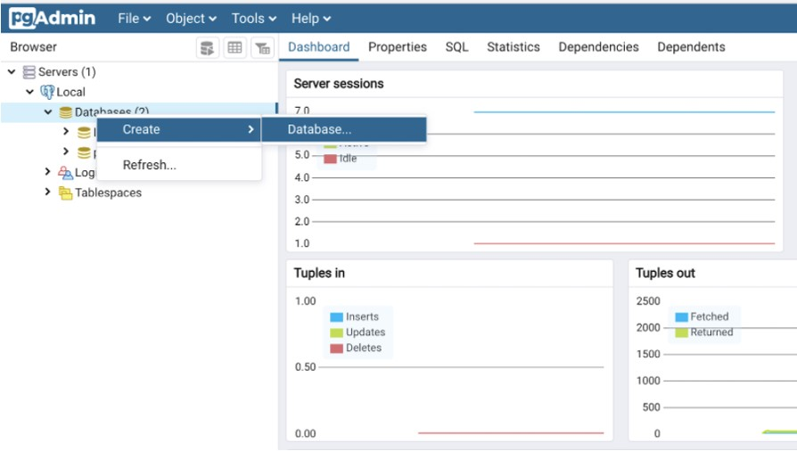

En el campo Database escribe el nombre “platzimovies” y en el campo owner selecciona el usuario que será dueño de la base de datos.

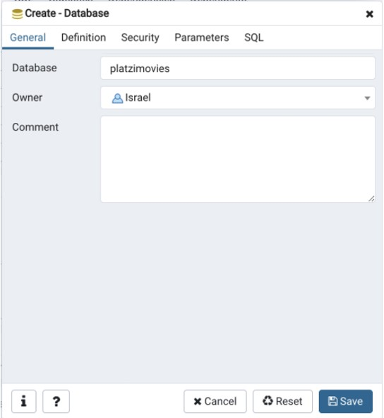

Da click en el botón Save. Y posteriormente selecciona la base de datos recién creada en el menú derecho.

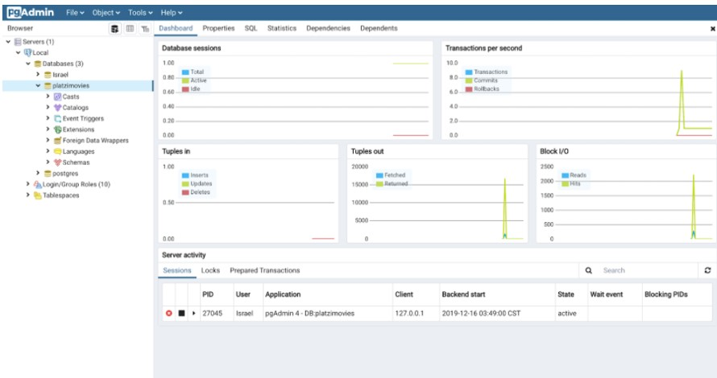

#### Paso 3: Configura la restauracion

Dirígete al menú Tools (Herramientas) y da click en la opción Restore (Restaurar).

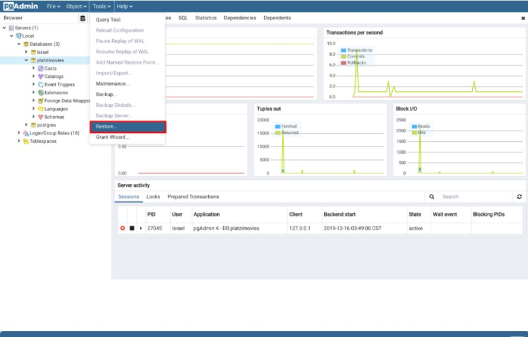

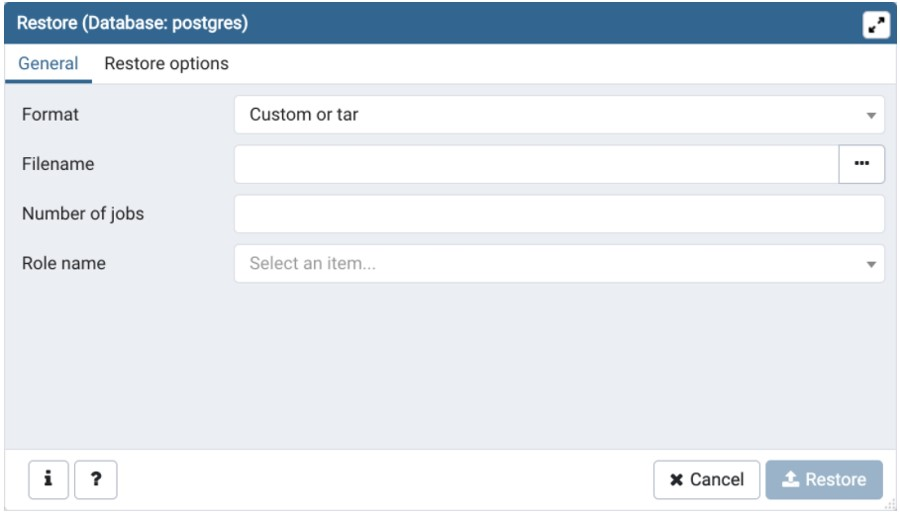

#### Paso 3: Importa desde archivo

Selecciona la opción Custom or tar en el campo Format. En Role name elige el usuario con permisos root, normalmente es el usuario postgres o el nombre de usuario de tu computadora.

Finalmente, en el campo Filename selecciona el botón de 3 puntos y selecciona el archivo que deberás descargar haciendo click [aquí](https://drive.google.com/open?id=1oE7A4z_D2o-udn_yflwZ03uN3cA0gVpr)

Da click en el botón Restore.


Al ejecutar la restauración encontrarás un mensaje similar al siguiente:

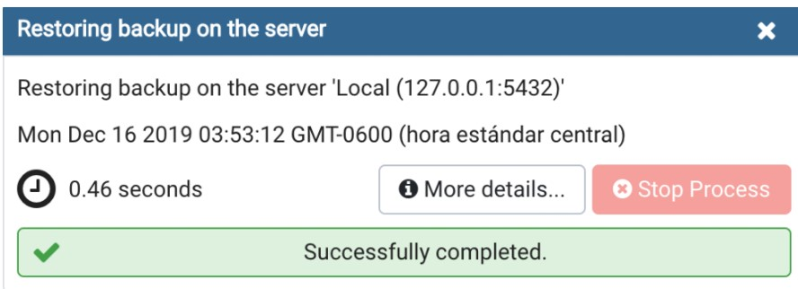

#### Paso 4: Verifica que las tablas fueron creadas

Yendo al menú izquierdo, dirígete a Servers > Local > Databases > platzimovies > Schemas > public > Tables.

Verifica que ahí aparecen todas las tablas que necesitamos para el ejercicio.

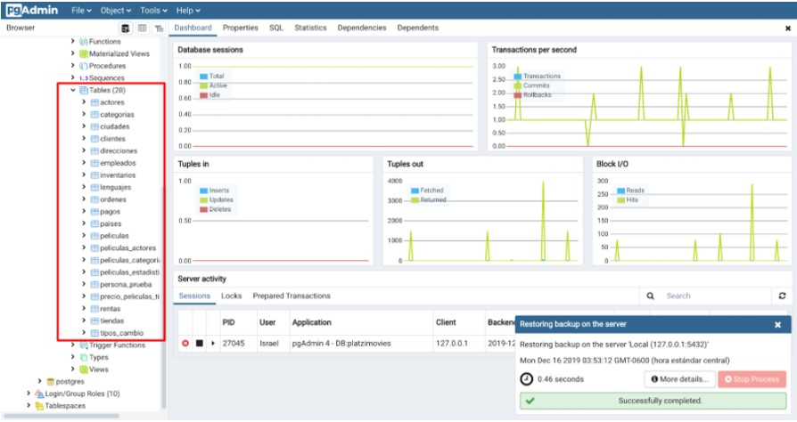

Si lo lograste, ¡felicidades! Estás listo para usar nuestra base de datos de ejemplo.

### Clase 3 Breve historia de las bases de datos

Originalmente las bases de datos se guardaba en forma de texto de manera plana, después nace el concepto de bases de datos relacionales donde pudimos realizar llamado de datos, operaciones matemáticas, etc.

Existen diversos tipos de bases de datos como Mysql, MariaDB, PostgreSqSQL entre otras, también existen otros tipos NO SQL como las basadas en documentos, basadas en grafos, columnares, guardadas en memoria, etc, donde dependiendo del caso de uso escogeremos la herramienta mas adecuada.

Las bases de datos son esa navaja suiza en la mochila del desarrollador.

### Clase 4 Puntos fuertes de las bases de datos relacionales

Puntos fuertes de la RDB

- Multiproposito (resuelve muchos problemas con una sola herramienta)
- Ampliamente utilizadas (hoy mas que nunca para la ciencia de datos y cualquier aplicación)
- Informacion consistente
- Flexible
- Retrocompatible
- Completamente programable (permite usar lenguajes procedurales dentro de la base de datos)

### Clase 5 Conceptos importantes de las bases de datos relacionales

Esta clase aborda los conceptos que si o si debes tener para operar una base de datos relacional.

- **Entidades:** Las entidades se traducen en cosas del  mundo real (una taza, un reloj, una fruta) un objeto por lo tanto es una entidad.

- **Atributos:** son las propiedades que definen al objeto (color, sabor, forma).

- **Relaciones:** son la manera en que se unen una entidad con otra entidad, una tabla puede ser el reloj y otra las manecillas que tiene un reloj (horas, minutos, segundos) esto relaciona manecillas y relojes sin repetir la informacion, de esta forma las relaciones nos permite ligar informacion entre entidades 1 a 1, 1 a muchos, muchos a muchos (cuando encontramos esta relación la partimos en una tabla transitiva).

- **Store procedures:** son básicamente funciones o procedimientos que nos permite almacenar el manejador de base de datos y que nos permite ejecutar una y otra vez de manera util sin tener que repetir el mismo código o sentencia.

- **Triggers:** los  disparadores son funciones que nos permite ligar los Store Procedures con un evento (después de insertar un registro por ejemplo)

### Clase 6 Principales sentencias SQL

Estos comandos serán ejecutados en el Query Tool de PGAdmin.

```SQL
SELECT MAX(ultima_actualizacion) AS fecha_ultima_actualizacion,
    clasificacion,
    COUNT (*) AS cantidad_peliculas
FROM peliculas
WHERE duracion_renta > 3
GROUP BY clasificacion, ultima_actualizacion
ORDER BY fecha_ultima_actualizacion
;
```

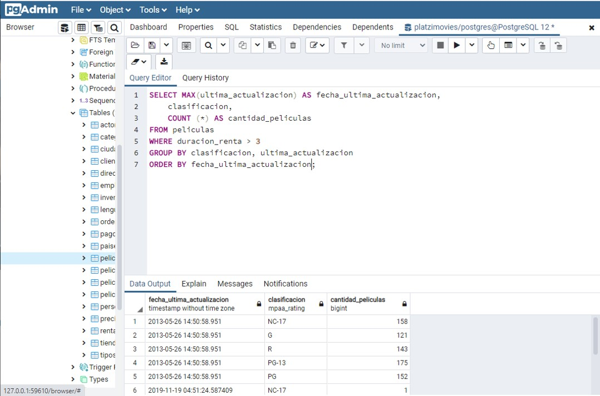

## Modulo 2 Ciencia de Datos

### Clase 7 Que es la ciencia de datos

Idealmente tienes en una compañía un equipo de datos, el científico de datos muy comúnmente se ocupa de liderar el equipo, tiene el científico de datos tiene la facultad de entender bien el negocio y de traducir las necesidades de datos dentro de una organización y traducirlo a algo que se pueda  accionar por parte de los demás equipos de datos, (analistas, DBA, etc).

La aportación mas grande de un científico de datos a la empresa en la que trabaja es el impacto, tu trabajo es que los datos impacten de manera positiva  ala organización, y tienes todos los recursos a la mano.

Si bien en el mundo ideal debe existir todo un equipo de datos detrás de ti para tomar las decisiones muchas veces seras el único científico encargado de datos (seras un one man army).

En la empresas siempre habrá la necesidad de tomar los datos que ya existen y que con ellos se cuenta una historia que ayude a impulsar y tomar decisiones que afecten a las empresas positivamente.

### Clase 8 Aplicacion de la ciencia de datos

En una organización la parte donde mas van a ayudar los datos es en la toma de decisiones.

Hay un concepto actual muy buzzword que es **data driven** básicamente se toman las decisiones informadas basadas en los datos históricos o en el punto actual, como científico de datos es tu responsabilidad el tomar o muchas veces extraer la informacion de la empresa y presentarla de forma coherente par aque las personas indicadas.

La **informacion significativa** tiene que ver con la historia que tu Vas a contar, cuando tienes datos lo primero ess abstraer los datos que nos serviran para el análisis y la forma en que contaremos su historia y visualización.

Hay datos que nos sirven mucho como aquellos que permiten crear una linea de tiempo, gráficas para hacer contrates entre los datos pero sobre todo tener el formato adecuado para el publico adecuado

Siempre debemos tener en cuenta la neutralidad de los datos para evitar que incurramos en discriminación toma de ejemplo gpt-2

Pero lo mas importante siempre debes contar una historia y dar un mensaje a traves de los datos.

### Clase 9 Equipos orientados a datos

En un mundo ideal tu llegaras a una organización y formaras parte de un equipo orientado a datos, en el los roles pueden ser los siguientes:

- **DBA (Data Base Administrator):** como su nombre lo indica mantiene y da soporte a las bases de datos, tiene un rol mas de soporte, respaldos y data del dia a dia.

- **Data Warehouse (Almacén de datos):** debe tomar los datos que se masivos generan dia a dia en la organización y guardarlos en un medio del que sean fácilmente extraibles esto quiere decir que los guardara de una forma pensando que a futuro esos datos serán útiles.

- **ETL/Data Pipelines (Extract Transform Load / Tuberías de Datos)**: tomar la data que entra a la app en forma de documento y guardar la data en una base de datos donde después pueda aplicarsele estadísticas y obtener informacion relevante mas allá del solo estado de la app.

- **BI (Business Intelligence):** Es uno de los precursores de lo que es el Data Science, el se encarga de extraer los datos, analizarlos, encontrar patrones y entender las repercusiones que pueden tener para el negocio.

- **ML (machine learning):** este rol es muy importante ya que nos permite clasificar y encontrar patrones en la data o predecir valores basándonos en data histórica.

- **Data Science (Ciencia de Datos):** su labor es entender a la organización e impactarla de manera positiva, debe tener la capacidad de poder hacer algunas de las cosas que realizan los otros roles pero ademas **entender las necesidades de la organización** y planear el camino en el que se utilizaran las experiencias y destrezas de las otras areas para entregar resultados positivos para la organización.

### Clase 10 Data science vs Machine Learning

- **Machine Learning:** es un conjunto de ciencias, estrategias, disciplinas y algoritmos que nos van a ayudar a tomar la capacidad analítica de una computadora y tratar a traves de algoritmos adaptables de resolver diversos problemas, dos casos de uso muy particulares tiene que ver con **clasificacion** (a traves de identificación patrones) y **predicciones** (tomando data histórica aplicamos como mínimo una regresión lineal como algoritmo mas simple)

- **Data Science:** se enfoca en conocer una empresa de forma muy granular y entiende sus necesidades a un nivel que puede hacer algo al respecto, puede que coordine un equipo o de manera sola tomar todas las variables de la organización y tomar todas las herramientas disponibles unirlas para generar sinergia con las herramientas y los datos para impactar de manera positiva a la organización.

Cual es la relación entre las dos areas?

Si bien ML nos permite encontrar patrones, lejos de desplazar a la ciencia de datos el ML se convierte en una gran  herramienta en nuestro cinturón de batman.

Recuerda que como futuro cientifico de datos tu labor es conocer y aplicar las herramientas, también recuerda que no podemos sacar un clavo con un destornillador, siempre analiza y aplica la mejor herramienta para el problema a enfrentar.

## Modulo 3 Particularidades de PostgreSQL

### Clase 11 Diferencias entre otros manejadores y PostgreSQL

Vamos a ver esta clase desde dos perspectivas para Postgres.

- Es de **código abierto** y orientado a la comunidad

- Sumamente adaptable funciones avanzadas como **soporte para documentos json y funciones estadísticas**

- **PL/pgSQL** (Procedural Language PostgreSQL)

- Postgres **orientado Manejo de objetos** como Json.

- **Implementa las particiones** físicas nuestra tabla y establecer una estrategia para el guardado de la informacion y reducción de tiempos de ejecución.

- **Common table expressions** (tratamiento de tablas virtuales que se manejan en el momento) postgres optimiza este tipo de funciones, y permite un tratamiento mas eficiente y mas eficientes en términos de tiempo de ejecución y recursos de maquina respecto al tiempo de ejecución.

- **Window functions** trata de encontrar relaciones entre un registro (un row en particular) y el resto de los registros

### Clase 12 Conoce los superpoderes de PLPGSQL

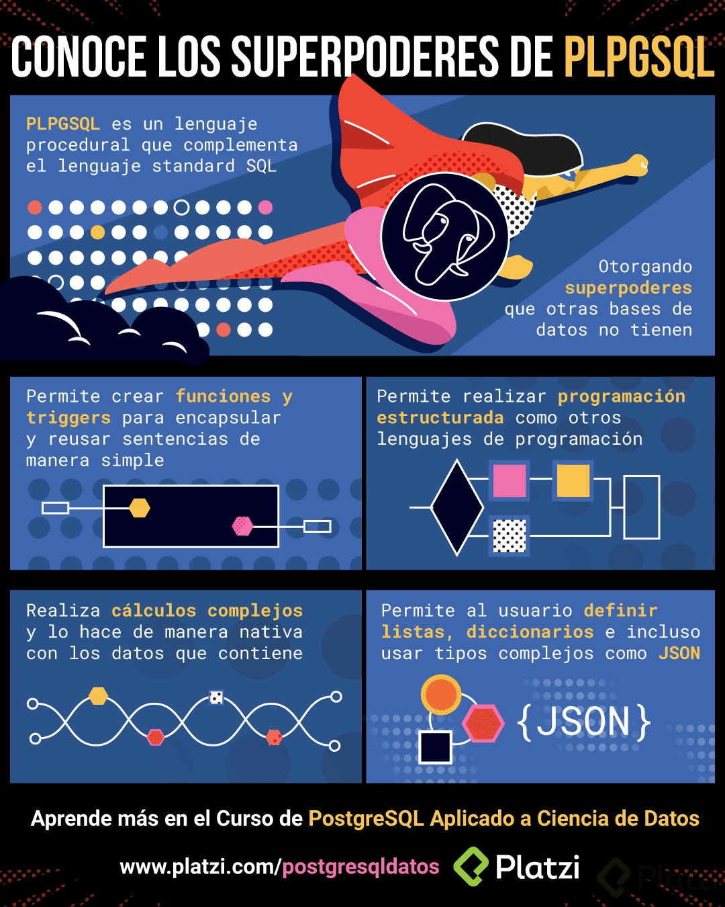

### Clase 13 PLPGSQL: Stored procedures

PLPGSQL es el lenguaje que Postgres creo para hacer programacion estructurada que tiene el componente fuerte para hacer Triggers y Stored Procedures.

Un **procedure** (procedimiento), es algo muy similar a una funcion pero que no retorna ningun valor esto quiere decir que **ejecutara todos los pasos del procedimiento pero al final no retorna o extrae ningun valor** (a diferencia de las funciones que si retornan valores).

PL/pgSQL es un superset, puedes hacer todo lo SQL pero también Stored Procedures, Functions y Triggers.

Veremos en el código el primer ejemplo de Procedure.

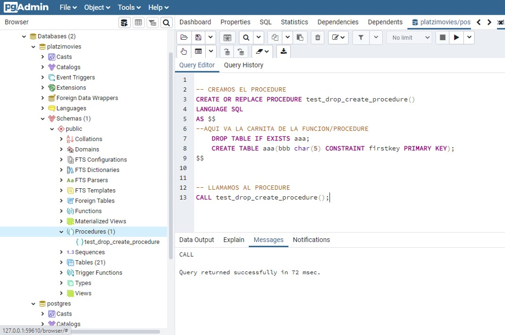

Con este ejercicio  puedes observar que cualquier cosa que tengas que realizar una y otra vez lo puedes encapsular en un procedimiento y llamarlo como una funcion cada vez que lo necesites.

La primer parte crea un procedure y lo guarda ebn el arbol de la base de datos.

```sql
-- CREAMOS EL PROCEDURE
CREATE OR REPLACE PROCEDURE test_drop_create_procedure()
LANGUAGE SQL
AS $$
--AQUÍ VA LA CARNITA DE LA FUNCION/PROCEDURE
    DROP TABLE IF EXISTS aaa;
    CREATE TABLE aaa(bbb char(5) CONSTRAINT firstkey PRIMARY KEY);
$$
```

La segunda parte ejecuta ese procedure, cada que lo necesitemos basta con llamarlo con el keyword CALL en cualquier script/consulta de la base de datos, como observamos arriba son solo una serie de instrucciones que no retornan ningun valor.

```sql
-- LLAMAMOS AL PROCEDURE
CALL test_drop_create_procedure();
```

Ahora haremos algo diferente utilizando el lenguaje de PostgreSQL, en este ejercicio crearemos una funcion, esto es propio de postgres y usa los keywords **BEGIN** y **END**

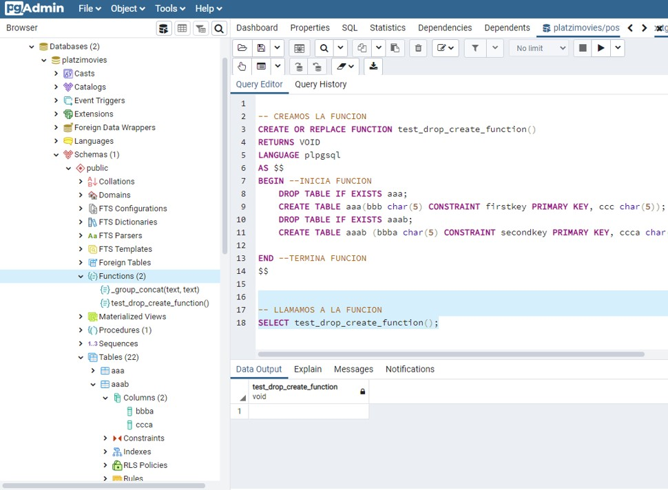

Al igual que el ejercicio anterior la primer parte hace referencia a la funcion que vamos a guardar, la cual retorna un valor vacio (void en ingles) y hace uso del lenguaje plpgsql, la sentencia de la funcion ahora se encuentra entre los keywords BEGIN y END.

```sql
-- CREAMOS LA FUNCION 
CREATE OR REPLACE FUNCTION test_drop_create_function()
RETURNS VOID
LANGUAGE plpgsql
AS $$
BEGIN --INICIA FUNCION
    DROP TABLE IF EXISTS aaa;
    CREATE TABLE aaa(bbb char(5) CONSTRAINT firstkey PRIMARY KEY, ccc char(5));
    DROP TABLE IF EXISTS aaab;
    CREATE TABLE aaab (bbba char(5) CONSTRAINT secondkey PRIMARY KEY, ccca char(5));

END --TERMINA FUNCION
$$
```

Observamos como al ejecutar la funcion se ha guardado en el arbol al igual que lo hizo el procedure, ahora llamamos a la funcion con **SELECT**.

```SQL
-- LLAMAMOS A LA FUNCION
SELECT test_drop_create_function();
```

### Clase 14 PLPGSQL: conteo, registro y triggers

Esta clase continua con las funciones y después las meteremos en un trigger (este procedimiento deberás aprenderlo, taladrarlo en tu cabeza y dominarlo).

Creamos la primer funcion del ejemplo

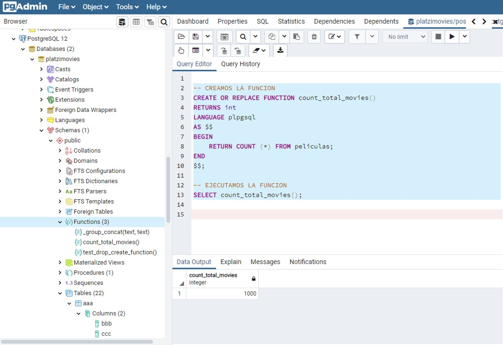

```sql
-- CREAMOS LA FUNCION
CREATE OR REPLACE FUNCTION count_total_movies()
RETURNS int
LANGUAGE plpgsql
AS $$
BEGIN
 RETURN COUNT (*) FROM peliculas;
END
$$;

-- EJECUTAMOS LA FUNCION
SELECT count_total_movies();
```

A continuación creamos una funcion encaminada  a ser un Trigger, recuerda que los disparadores se ejecutan cuando algo sucede. La idea en general de la siguiente funcion es tomar un registro de una tabla y duplicarlo en otra.

Observa que al crear la funcion se agrega esta el el arbol en la parte de triggers, pero el trigger entra en acción o se activa hasta que lo creamos en la segunda sentencia.

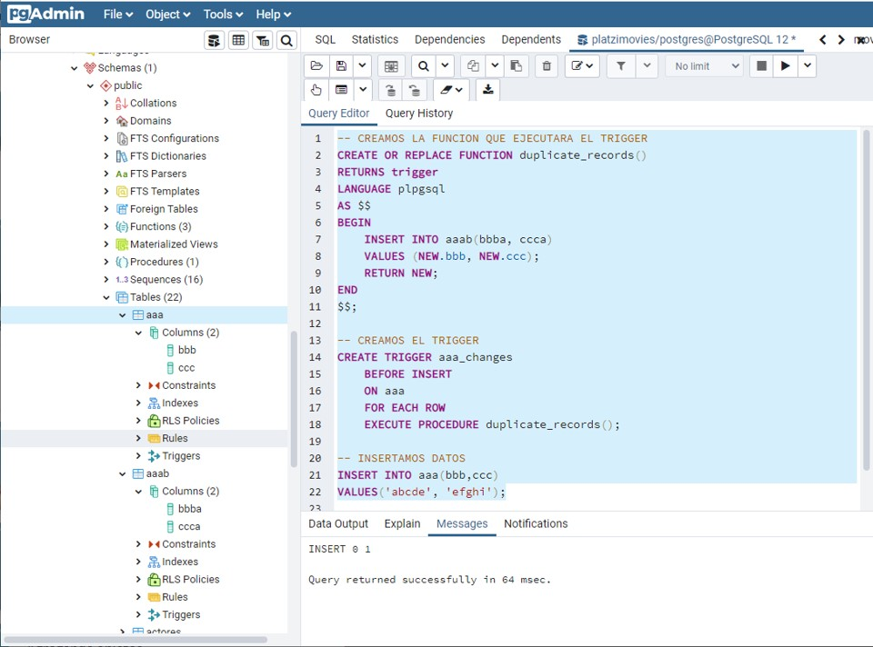

```sql
-- CREAMOS LA FUNCION QUE EJECUTARA EL TRIGGER
CREATE OR REPLACE FUNCTION duplicate_records()
RETURNS trigger
LANGUAGE plpgsql
AS $$
BEGIN
    INSERT INTO aaab(bbba, ccca)
    VALUES (NEW.bbb, NEW.ccc);
    RETURN NEW;
END
$$;

-- CREAMOS EL TRIGGER
CREATE TRIGGER aaa_changes
    BEFORE INSERT
    ON aaa
    FOR EACH ROW
    EXECUTE PROCEDURE duplicate_records();

-- INSERTAMOS DATOS
INSERT INTO aaa(bbb,ccc)
VALUES('abcde', 'efghi');
```

### Clase 15 PLPGSQL: Aplicado a data science

La funcionalidad de triggers y funciones es tan amplia que permite hacer cosas realmente complejas.

Dentro de las actividades que puedes llegar a realizar como cientifico de datos esta el que summarizes datos, entregues reportes, promedios, recopilación de datos, o integrarla den forma que sea visualizable.

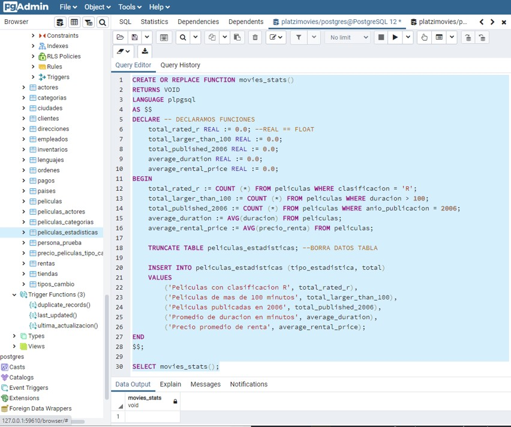

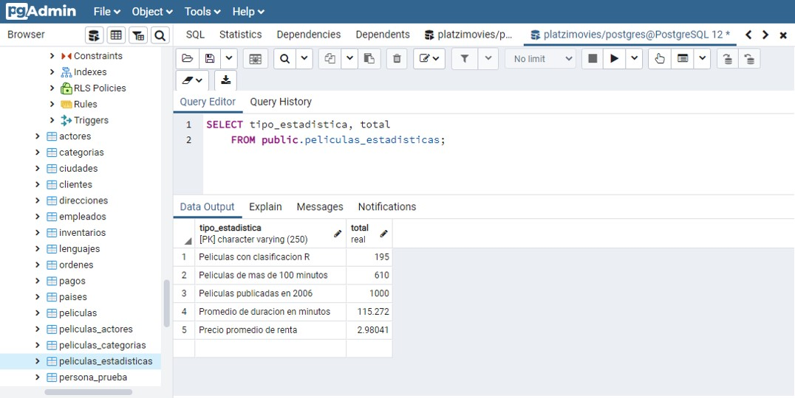

```sql
CREATE OR REPLACE FUNCTION movies_stats()
RETURNS VOID
LANGUAGE plpgsql
AS $$
DECLARE -- DECLARAMOS FUNCIONES
    total_rated_r REAL := 0.0; --REAL == FLOAT
    total_larger_than_100 REAL := 0.0;
    total_published_2006 REAL := 0.0;
    average_duration REAL := 0.0;
    average_rental_price REAL := 0.0;
BEGIN
    total_rated_r := COUNT (*) FROM peliculas WHERE clasificacion = 'R';
    total_larger_than_100 := COUNT (*) FROM peliculas WHERE duracion > 100;
    total_published_2006 := COUNT (*) FROM peliculas WHERE anio_publicacion = 2006;
    average_duration := AVG(duracion) FROM peliculas;
    average_rental_price := AVG(precio_renta) FROM peliculas;

    TRUNCATE TABLE peliculas_estadisticas; --BORRA DATOS TABLA

    INSERT INTO peliculas_estadisticas (tipo_estadistica, total)
    VALUES
        ('Peliculas con clasificacion R', total_rated_r),
        ('Peliculas de mas de 100 minutos', total_larger_than_100),
        ('Peliculas publicadas en 2006', total_published_2006),
        ('Promedio de duracion en minutos', average_duration),
        ('Precio promedio de renta', average_rental_price);
END
$$;

SELECT movies_stats();
```

### Clase 16 Integración con otros lenguajes

#### Conectores

Como la mayoría de las bases de datos, PostgreSQL cuenta con conectores para diferentes lenguajes de programación, de tal forma que si trabajas con Python, PHP, Java, JavaScript y todos sus frameworks, exista una forma de extraer datos de PostgreSQL y posteriormente utilizar las propiedades de los lenguajes procedurales para transformar y utilizar los datos.

El lenguaje estándar utilizado en bases de datos relacionales es SQL (Structured Query Language), un lenguaje que tiene una estructura sumamente útil para hacer solicitudes de datos, en especial tomando como abstracción un diseño tabular de datos. Sin embargo, carece de estructuras de control y otras abstracciones que hacen poderosos a los lenguajes procedurales de programación.

#### PL/pgSQL

Como respuesta a los puntos débiles de SQL como estándar, PostgreSQL respondió originalmente creando un lenguaje propio llamado PL/pgSQL (Procedural Language/PostgreSQL Structured Query Language) que es literalmente un superset de SQL que incluye propiedades de un lenguaje estructurado que, por un lado, nos permite crear funciones complejas y triggers; y, por el otro lado, agrega estructuras de control, cursores, manejo de errores, etc.

#### Otros lenguajes

Sin embargo, en muchos sentidos, aunque PL/pgSQL ayuda en los casos más genéricos para generar estructuras y funcionalidades más complejas, no se compara con lenguajes completamente independientes y no ligados directamente a una base de datos.

La respuesta sin embargo tampoco es los conectores normales que, si bien resuelven la parte de un lenguaje más complejo, añaden por otro lado una separación de la base de datos, ya que debe correr en un servidor separado y hacer llamadas entre ellos con la latencia como un colateral.

Para mitigar estos problemas tomando lo mejor de ambos mundos, los desarrolladores de PostgreSQL se dedicaron a hacer implementaciones de diversos lenguajes a manera de plugin.

#### C
La biblioteca que permite al lenguaje C ejecutarse en PostgreSQL es llamada libpq y es una interfaz de programación que permite extender y hacer de interfaz para permitir a otros lenguajes ejecutarse en esta base de datos.

Puedes encontrar más información de esta interfaz en el siguiente link:

<https://www.postgresql.org/docs/11/libpq.html>.

#### PL/Tcl

Tcl (Tool Command Language) es un lenguaje diseñado con la simpleza en mente y su paradigma consiste en que todo en él es un comando, incluyendo la estructura del lenguaje que, sin embargo, son suficientemente flexibles para poderse sobrescribir, haciéndolo un lenguaje sumamente extensible.

Todo lo anterior es ideal para la integración con el manejador de PostgreSQL ya que permite elaborar comandos para ejecutar las sentencias SQL y extenderlas fácilmente.

Si quieres leer más del tema, puedes hacerlo en el siguiente link:

<https://www.postgresql.org/docs/11/pltcl.html>.

#### PL/Perl

Perl es un lenguaje de programación que implementa una estructura de bloques de código y que toma inspiración de programas como C, sh, AWK, entre otros. Y es especialmente bueno para el tratamiento de cadenas de texto. Sin embargo, no se encuentra limitado como un lenguaje de script.

Dada la propiedad de englobar funcionalidad en forma de bloque y de la rapidez y facilidad con la que trabaja con datos tipo cadena, este lenguaje es ideal para el tratamiento de información de una base de datos relacional.

Para conocer más de la implementación de este lenguaje con PostgreSQL puedes leer el siguiente link:

<https://www.postgresql.org/docs/11/plperl.html>.

#### PL/Python
Python, al ser de los lenguajes de programación más extendidos entre programadores de servicios Backend, es una implementación particularmente interesante para PostgreSQL.

Python es un lenguaje de programación fuerte en tratamiento de estructura de datos y tiene un paradigma múltiple con fuertes componentes orientados a objetos, estructurados y una fuerte influencia del paradigma funcional.

Parte de sus fortalezas son sus implementaciones de funciones map, reduce y filter en conjunto con list comprehensions, sets, diccionarios y generadores.

Dadas las propiedades nativas para manejar estructuras de datos complejas, es un lenguaje ideal para manejar la salida de un query SQL.

La implementación de Python para PostgreSQL te permite crear funciones complejas en un lenguaje completo y popular sin tener que utilizar PL/pgSQL. Puedes ver un ejemplo a continuación de la misma función en PL/pgSQL y PL/Python.

**Ejemplo PL/pgSQL**.

```sql
CREATE FUNCTION pgmax (a integer, b integer)
RETURNS integer
AS $$
BEGIN
   IF a > b THEN
       RETURN a;
   ELSE
       RETURN b;
   END IF;
END
$$ LANGUAGE plpgsql;
```

**Ejemplo PL/Python**.

```sql
CREATE FUNCTION pymax (a integer, b integer)
RETURNS integer
AS $$
   if a > b:
       return a
   return b
$$ LANGUAGE plpythonu;

CREATE EXTENSION plpythonu;
SELECT pgmax(200,9);
```

Para instalar el lenguaje Python en PostgreSQL, una vez instaladas las bibliotecas apropiadas para cada Sistema Operativo, es necesario ejecutar el siguiente query:

```sql
CREATE EXTENSION plpythonu
```

Si quieres profundizar más en esta implementación puedes encontrar más información aquí:

<https://www.postgresql.org/docs/11/plpython.html>.

### Clase 17 Tipos de Datos Personalizados

Siguiendo con las particularidades de Postgres tenemos una funcion que se puede considerar avanzada y que no todos los manejadores proveen y es **Tipos de dato definidos por el usuario** y que este lo pueda controlar, hay dos vertientes

- JSON
- Lista

En el ultimo nos ayuda a tener una lista predefinida de posibilidades entre las cuales elegir y cerrar el abanico de opciones y no se pueda meter cualquier tipo de dato en el campo que vamos a elegir, veamos con esto con un ejemplo.

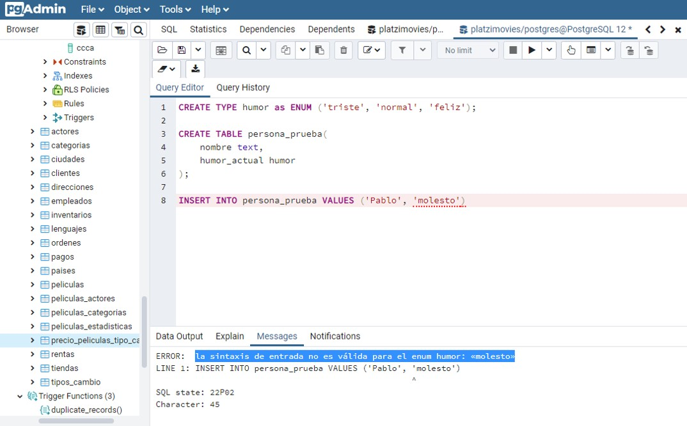

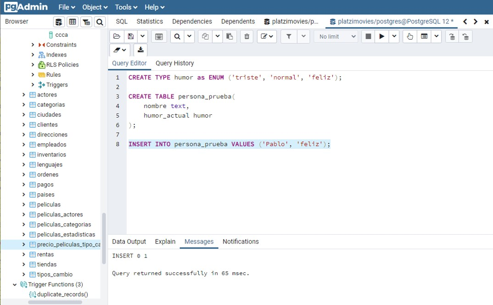

```sql
CREATE TYPE humor as ENUM ('triste', 'normal', 'feliz');

CREATE TABLE persona_prueba(
    nombre text,
    humor_actual humor
);

INSERT INTO persona_prueba VALUES ('Pablo', 'molesto')

INSERT INTO persona_prueba VALUES ('Pablo', 'feliz')
```

Esto es util si usamos clasificaciones predefinidas como la clasificacion de juegos/peliculas o tenemos un menu drop down en una app.

## Modulo 4 Casos Practicos

### Clase 18 Explicación de la estructura de la base de datos de ejemplo

Vamos a analizar el diagrama entidad-relación

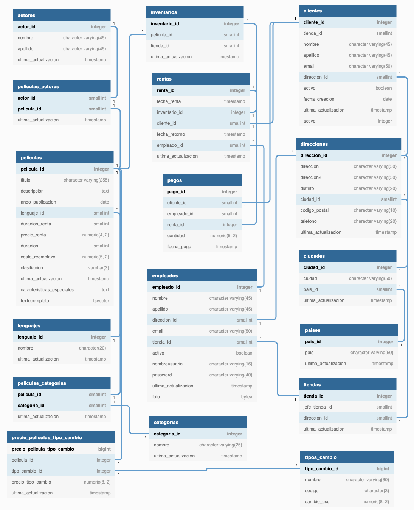

### Clase 19 Agregacion de datos

Agregación de datos es el encontrar formas en que podemos juntar los datos y sacar totales (datos sumarizados) y poder entregar reportes o en inteligencia para el negocio.

**Ejemplo 1:** sentencia MAX (obtener el máximo de una columna), en el ejemplo obtenemos el precio maximo por renta de película.

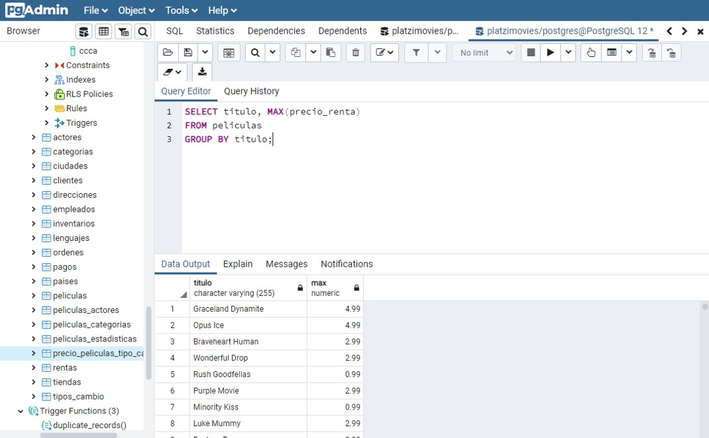

```sql
SELECT titulo, MAX(precio_renta)
FROM peliculas
GROUP BY titulo;
```

Haciendo el ejemplo un poco mas ordenado y enriquecido

```sql
SELECT titulo, MAX(precio_renta) AS precio_maximo_renta
FROM peliculas
GROUP BY titulo
ORDER BY precio_maximo_renta DESC;
```

Obteniendo el mínimo

```sql
SELECT titulo, MIN(precio_renta)
FROM peliculas
GROUP BY titulo;
```

**Ejemplo 2:** sentencia **SUM** (sumatoria), veremos el costo de rentar todas las peliculas del catalogo, esto nos podría servir para sacar distintos tipos de reportes como obtener las ganancias del periodo de interés (dia, mes, trimestre) y sentencia **COUNT** para realizar conteos.

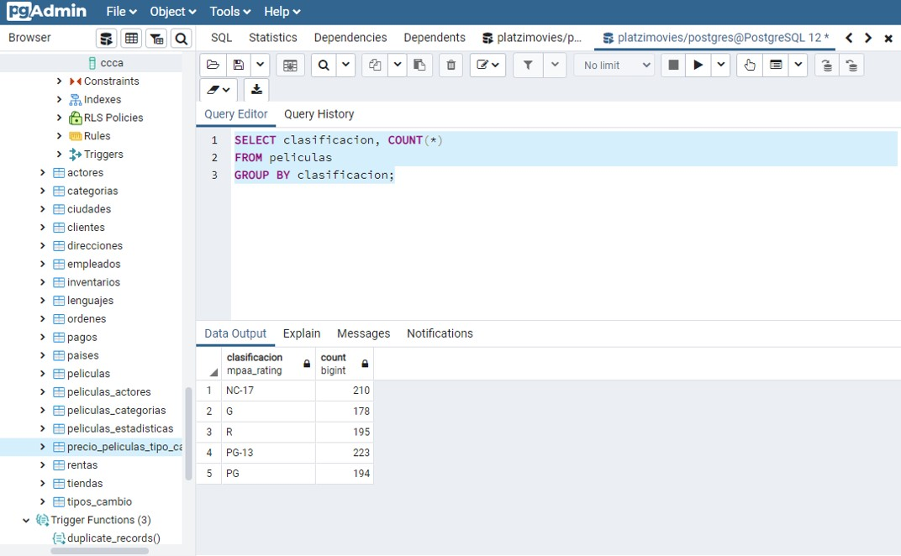

```sql
SELECT clasificacion, COUNT(*)
FROM peliculas
GROUP BY clasificacion;
```

**Ejemplo 3:** sentencia **AVG** (promedio)

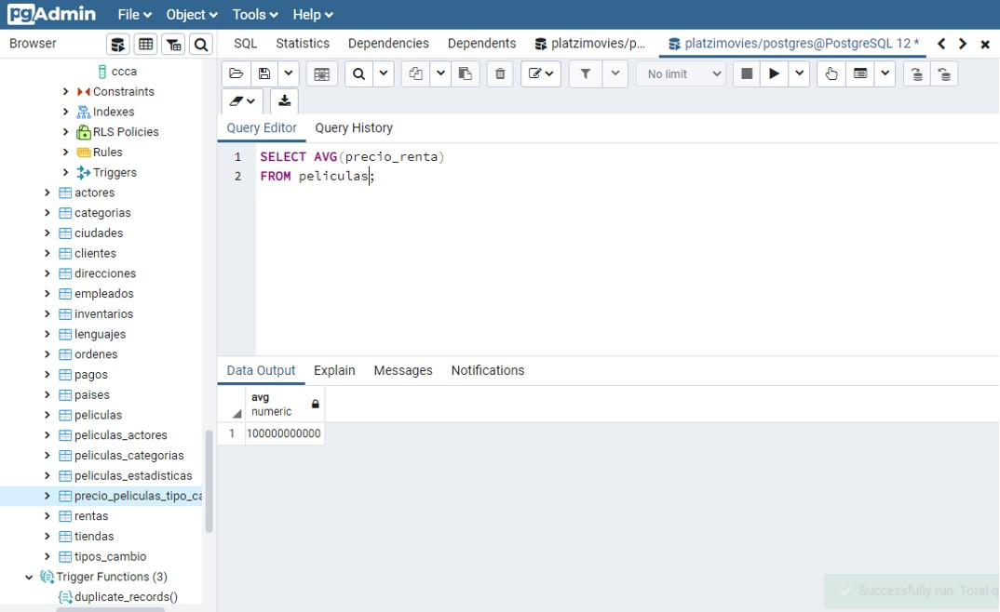

Utilizando lo aprendido vemos ahora los siguientes ejemplos.

**Precio promedio por clasificacion de película**.

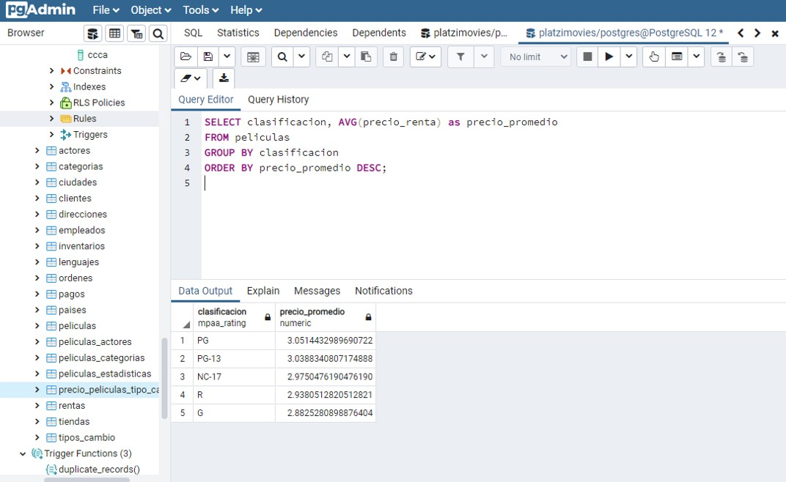

```sql
SELECT clasificacion, AVG(precio_renta) as precio_promedio
FROM peliculas
GROUP BY clasificacion
ORDER BY precio_promedio DESC;
```

**Duracion promedio por clasificacion de película**.

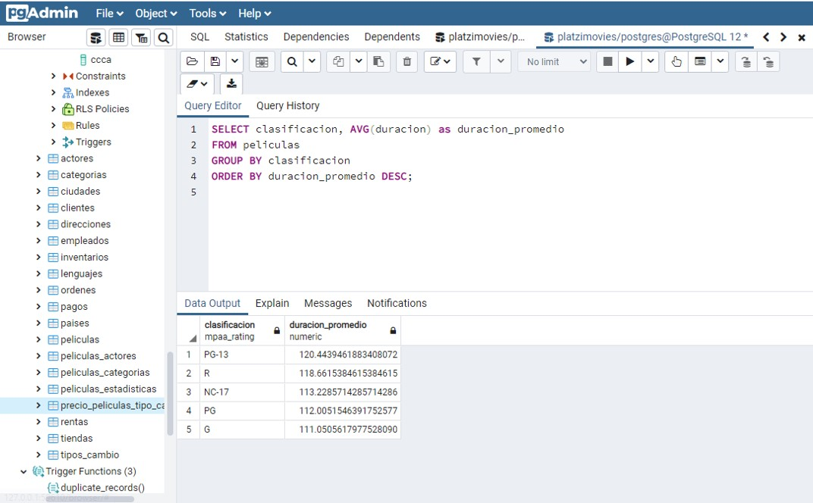

```sql
SELECT clasificacion, AVG(duracion_renta) as duracion_renta_promedio
FROM peliculas
GROUP BY clasificacion
ORDER BY duracion_renta_promedio DESC;
```

**Duracion renta promedio por clasificacion de película**.


```sql
SELECT clasificacion, AVG(duracion_renta) as duracion_renta_promedio
FROM peliculas
GROUP BY clasificacion
ORDER BY duracion_renta_promedio DESC;
```

**Reto:** Encontrar otro query de interés para el negocio.

```sql

-- PELICULAS MAS RENTADAS
SELECT peliculas.pelicula_id, peliculas.titulo, string_agg(DISTINCT CONCAT(actores.nombre, ' ', actores.apellido), ',') as nombes_actores  , count(*) AS rentas_acumuladas
FROM rentas
-- RELACIONA RENTAS CON INVENTARIOS
JOIN inventarios
    ON rentas.inventario_id = inventarios.inventario_id
-- RELACION PELICULAS CON NO. INVENTARIO (RENTAS NO TIENE EL ID PELICULA)
JOIN peliculas
    on inventarios.pelicula_id = peliculas.pelicula_id
-- RELACIONA PELICULAS CON ACTORES_PELICULAS
JOIN peliculas_actores
    ON peliculas.pelicula_id = peliculas_actores.pelicula_id
-- RELACIONA ACTORES_PELICULAS CON ACTORES
JOIN actores 
    ON actores.actor_id = peliculas_actores.actor_id

GROUP BY   peliculas.pelicula_id
ORDER BY rentas_acumuladas DESC;
```

### Clase 20 Pensando en la presentacion

La planeación siempre nos dará el norte de como presentar los datos, siempre es importante tener en mente la parte gráfica de como representar los datos antes de adentrarnos a escribir queries.

La forma mas común de consumir la informacion siempre sera los dashboard.

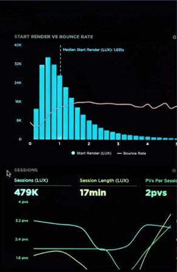

Ten en cuenta la linea de tiempo para mostrar temporalidades (ventas en x estación o época del año), las gráficas de pastel para mostrar la distribución de porcentajes o relaciones comparadas A con B y sumado en un 100%.

Quedate con el insight la presentacion de los datos siempre, siempre sera muy importante, y dar los datos en una buena presentacion puede generar los insights para potenciar a una organización.

### Clase 21 Trabajando con objetos

Una de las funcionalidades mas interesantes de Postgres es que nos permite trabajar con objetos JSON.

Postgres tiene dos implementaciones para esto, Json normal y JSONb (de binary) donde ellos guardan internamente el objeto en binario.

Trabajar con JSON dará mucha flexibilidad al desarrollo, y guardar estados, Postgres permite trabajar directamente con Json sin necesidad de usar parsers de python u otro lenguaje de programación.

Ejemplo

Creamos la tabla e insertamos datos de ejemplo

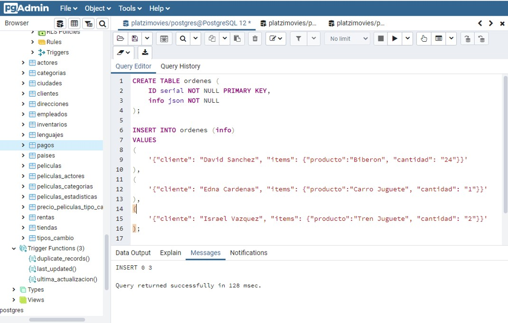

```sql
CREATE TABLE ordenes (
    ID serial NOT NULL PRIMARY KEY,
    info json NOT NULL
);

INSERT INTO ordenes (info)
VALUES
(
    '{"cliente": "David Sanchez", "items": {"producto":"Biberon", "cantidad": "24"}}'
),
(
    '{"cliente": "Edna Cardenas", "items": {"producto":"Carro Juguete", "cantidad": "1"}}'
),
(
    '{"cliente": "Israel Vazquez", "items": {"producto":"Tren Juguete", "cantidad": "2"}}'
);
```

Puedes obtener la respuesta como un select normal que contiene la data en json

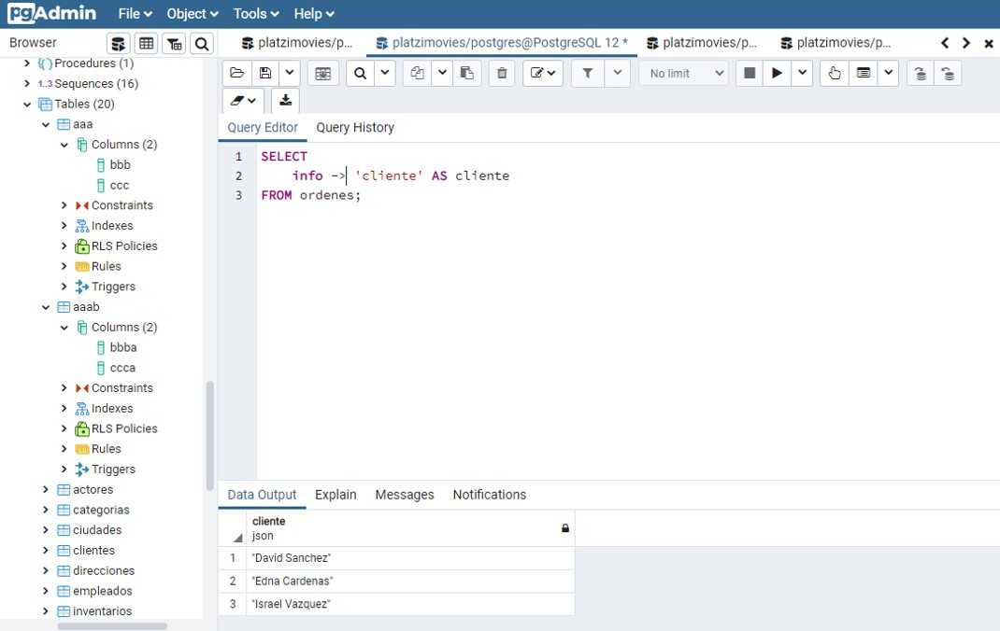

```sql
SELECT
    info -> 'cliente' AS cliente
FROM ordenes;
```

Podemos obtenerla como texto

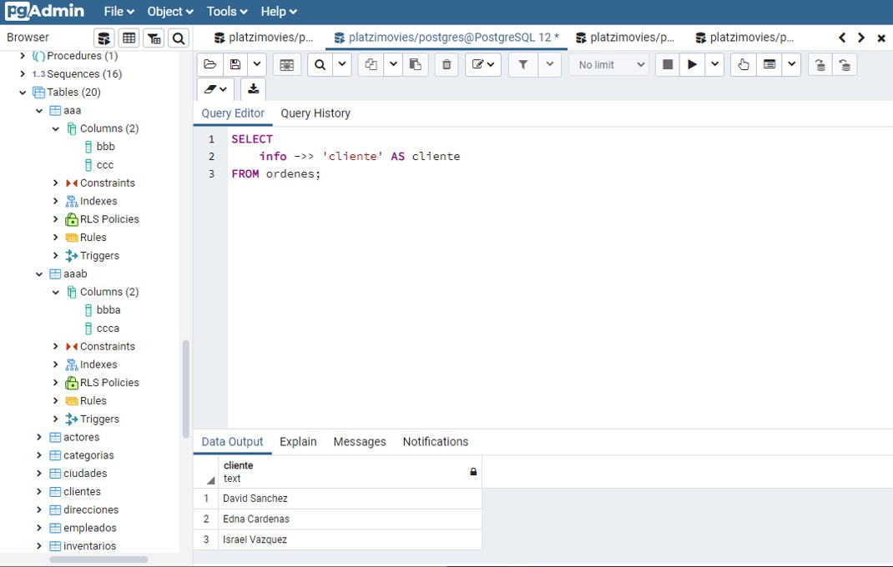

```sql
SELECT
    info ->> 'cliente' AS cliente
FROM ordenes;
```

Obtener todos los datos del json


```sql
SELECT
    info ->> 'cliente' as cliente,
    info -> 'items' ->> 'producto' as producto,
    info -> 'items' ->> 'cantidad' as cantidad
FROM ordenes;
```

Aplicando in **WHERE** para obtener determinada data

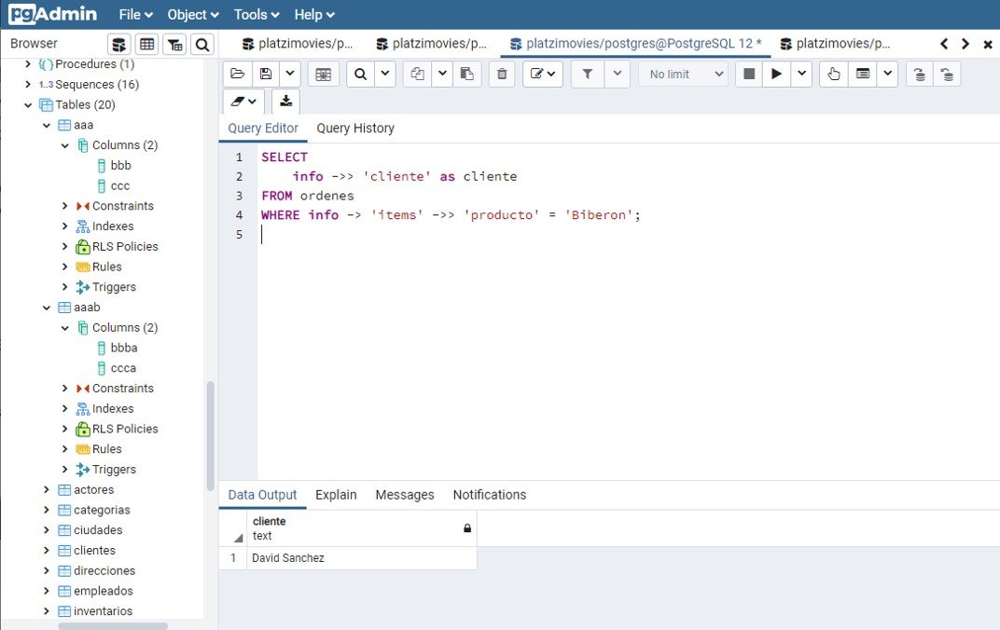

```sql
SELECT
    info ->> 'cliente' as cliente
FROM ordenes
WHERE info -> 'items' ->> 'producto' = 'Biberon';
```

### Clase 22 Agregando objetos

Exploraremos las propiedades de los objetos Json para realizar sumarizaciones, una habilidad que como Data Scientist requieres.


```sql
SELECT
    MIN (
        CAST ( -- CAST TRANSFORMA UN TIPO DE DATO EN OTRO
            info -> 'items' ->> 'cantidad' AS INTEGER
        )
    ),
    MAX (
        CAST ( -- CAST TRANSFORMA UN TIPO DE DATO EN OTRO
            info -> 'items' ->> 'cantidad' AS INTEGER
        )
    ),
    SUM (
        CAST ( -- CAST TRANSFORMA UN TIPO DE DATO EN OTRO
            info -> 'items' ->> 'cantidad' AS INTEGER
        )
    ),
    AVG (
        CAST ( -- CAST TRANSFORMA UN TIPO DE DATO EN OTRO
            info -> 'items' ->> 'cantidad' AS INTEGER
        )
    )
FROM Ordenes;
```

Ten en cuenta que el realizar este tipo de computo es costoso para el motor de base de datos una alternativa es usar la opción de JsonB que es un tanto mas eficiente, aunque también permite hacerle frente a bases NO SQL como MongoDB

### Clase 23 Common table expressions

Como parte de los casos practicos y de las herramientas que nos brinda postgreSQL existen los **Common table expressions**, esto tiene que ver con que se utilizan als expresiones de las tablas en una forma en que pueden ahorrar memoria, hemos visto cuestiones con sub-queries o anidaciones que pueden consumir demasiados recursos, y es la razón por la que se crearon estas herramientas que nos ayudan a quitar carga a estos procesos y hacer algunos procesos iterativos que SQL normal no nos permite utilizar estructuras de control e iterativas, las **Common table expressions** nos permite hacer este tipo de acciones

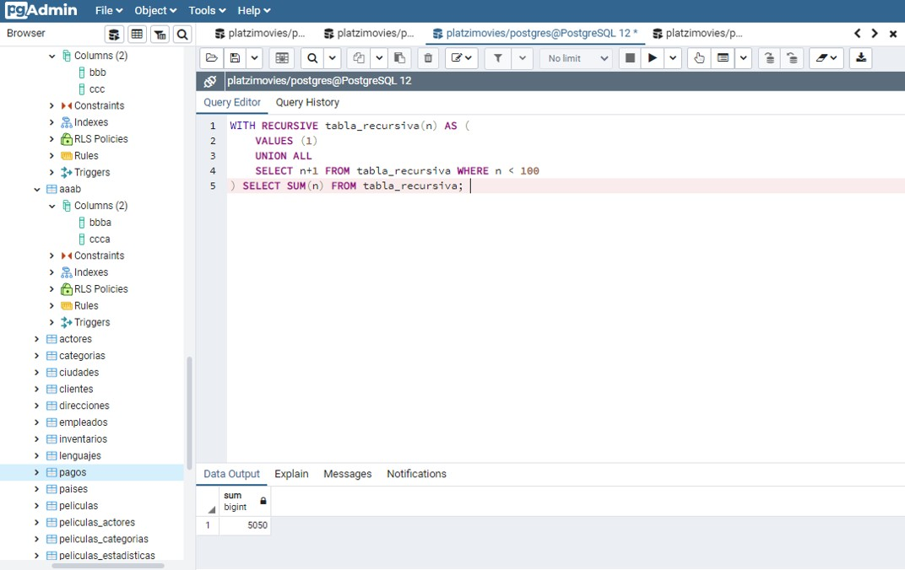

```sql
WITH RECURSIVE tabla_recursiva(n) AS (
    VALUES (1)
    UNION ALL
    SELECT n+1 FROM tabla_recursiva WHERE n < 100
) SELECT SUM(n) FROM tabla_recursiva; 
```

Otro caso de uso seria extraer los datos de una tabla y metiéndonos a otra pero iterando sobre ellos.

Lee mi tutorial en platzi

<https://platzi.com/tutoriales/1780-postgresql-datos/7204-common-table-expressions/>

Aquí un ejemplo del uso

```sql
-- tabla temporal 1
WITH peliculas_rentadas AS (
    SELECT pelicula_id, COUNT(fecha_renta) AS rentas_acumuladas
    FROM inventarios
    JOIN  rentas
        ON inventarios.inventario_id = rentas.inventario_id
    GROUP BY inventarios.pelicula_id
    ORDER BY rentas_acumuladas DESC
),

-- tabla temporal 2
peliculas_categoria_horror AS (
    SELECT pelicula_id, nombre
    FROM peliculas_categorias
    JOIN categorias
        ON peliculas_categorias.categoria_id = categorias.categoria_id
    WHERE
        categorias.nombre = 'Horror'
)

SELECT
    peliculas.titulo,
    peliculas.clasificacion,
    peliculas_categoria_horror.nombre AS genero,
    peliculas_rentadas.rentas_acumuladas AS rentas_acumuladas,
    precio_renta * (peliculas_rentadas.rentas_acumuladas) AS monto_rentas_acumulado

FROM peliculas
    JOIN peliculas_categoria_horror
        ON peliculas.pelicula_id = peliculas_categoria_horror.pelicula_id
    JOIN peliculas_rentadas
        ON peliculas.pelicula_id = peliculas_rentadas.pelicula_id

WHERE
    peliculas.duracion > 100 and peliculas.precio_renta < 1 ;
```

### Clase 24 Window functions

Otra de las caracteristicas muy importantes que tienes Postgres son las **window functions** que nos ayudan a **relacionar un row o un registro en particular con el resto de registros de la tabla y cual es su relación** con ellos, por ejemplo como se posiciona dentro de un ordenamiento o cual es el rango que ocupa.

Con los **window functions podemos hacer un rank** saber en que lugar se ocupa cierto campo, cual tiene mayor cantidad, cual es el 1er, el 2do o el 3ero, todo eso sin hacer sub-queries nos permitirá obtener relaciones entre los datos de forma sencilla.

Otras cosas que puedes hacer es obtener un rango, percent_rank, dense_rank (diferenciar valores repetidos)

Aquí el enlace a la documentación <https://www.postgresql.org/docs/12/functions-window.html>

### Clase 25 Particiones

Otra de las caracteristicas muy interesantes y muy practicas que no todos los navegadores nos ofrecen es el uso de particiones (véase el curso de Introduccion a Postgres de Platzi) de manera explicita.

Todos los manejadores hacen el particionado internamente para segmentar los datos y aumentar el performance, postgres permite hacer particiones custom (mes,año, etc), esta estrategia es muy buena y poderosa, sin embargo no todas las tablas deben ser particionadas.

**Una desventaja del particionado es que no puedes tener una sola clave única o id, por lo que esas llaves primaria no existen y no existe la consistencia de datos**, aquí el indice sera el campo por el que filtras. En contraste son buenísimas para los dashboards, ya que la informacion siempre esta segmentada y es inmediata (siempre hay un trade-off).

## Modulo 5 Platzi movies dashboard

### Clase 26 Presentación del proyecto

Uno de los productos finales de un Data Science son los dashboards que nos permiten ofrecer informacion relevante de las empresas, recordando que debemos cuidar el publico objetivo de los mismos.

Para esta sección tomaremos un enfoque técnico, sin la parte de visualización.

### Clase 27 Top 10

Los dashboards generalmente se miden como data points, generalmente tienen diferentes secciones, algunas tabulares, otras con formas de gráfica y en este caso vamos a realizar un top 10 de rentas de peliculas (aunque ya lo hice antes en el reto y el tutorial Hi Five).

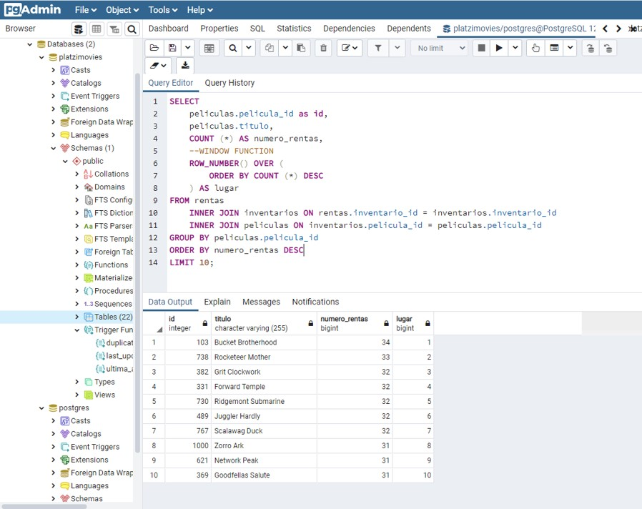

```sql
SELECT
    peliculas.pelicula_id as id,
    peliculas.titulo,
    COUNT (*) AS numero_rentas,
    --WINDOW FUNCTION
    ROW_NUMBER() OVER (
       ORDER BY COUNT (*) DESC
    ) AS lugar
FROM rentas
    INNER JOIN inventarios ON rentas.inventario_id = inventarios.inventario_id
    INNER JOIN peliculas ON inventarios.pelicula_id = peliculas.pelicula_id
GROUP BY peliculas.pelicula_id
ORDER BY numero_rentas DESC
LIMIT 10;
```

**ROW_NUMBER()** es una **window function** que asigna un numero entero secuencial a cada row (fila) de un query resultante, una window function siempre contiene una clausula **OVER()** directamente seguida por el nombre de la window function y las argumentos de la misma.

A window function call always contains an OVER clause directly following the window function's name and argument(s).

```sql
ROW_NUMBER() OVER (
    [PARTITION BY expr1, expr2,...]
    ORDER BY expr1 [ASC | DESC], expr2,...
)
```

- *PARTITION BY* divide el set resultante retornado por la clausula FORM en particiones, esta clausula es opcional, si la omites el set resultante es tratado como una sola partición de datos.

- **ORDER BY** es una clausula requerida, esta ordena las filas en cada partición, ya que ROW_NUMBER es  una funcion de orden sensitiva o sensible al orden.

Finalmente a cada fila de la partición le es asignado un numero secuencial en la columna row_number

Otro ejemplo

```sql
-- TOP TEN MEJORES CLIENTES
SELECT
    ROW_NUMBER() OVER (
        ORDER BY sum(pagos.cantidad) DESC
    ) AS top_clientes,
    clientes.cliente_id,
    clientes.nombre,
    clientes.apellido,
    SUM(cantidad) AS total_pagos_cliente
    FROM pagos
    JOIN clientes ON pagos.cliente_id = clientes.cliente_id
    GROUP BY clientes.cliente_id
;
```

Usando **PARTITION BY** para segmentar los mejores clientes por tienda, usando tambien CTE's

```sql
-- TOP MEJORES CLIENTES
WITH ventas_peliculas_por_tienda AS (
    SELECT
    clientes.tienda_id AS sucursal,
    clientes.cliente_id,
    clientes.nombre,
    clientes.apellido,
    SUM(cantidad) AS total_pagos_cliente
    FROM pagos
    JOIN clientes ON pagos.cliente_id = clientes.cliente_id
    GROUP BY clientes.cliente_id, sucursal
    )
    SELECT 
        ROW_NUMBER() OVER (
        PARTITION BY sucursal
        ORDER BY total_pagos_cliente DESC
    ) AS top_clientes,
    sucursal,
    cliente_id,
    nombre,
    apellido,
    total_pagos_cliente
    FROM ventas_peliculas_por_tienda
    WHERE total_pagos_cliente > 150
    ;

```

### Clase 28 Actualizando precios

Otra de las tareas comunes que te encontraras en la ciencia de datos es actualizar datos o guardalos de una forma ligeramente diferente en otro lugar, en este caso vamos a hacer una actualizacion de precios de usd a mxn.

Para esta tarea vamos a usar la  tabla "tipos de cambio" y "precio_peliculas_tipo_cambio.

Primero creamos el query que nos permita obtener el costo de la renta de las peliculas convertido de $USD a $MXN

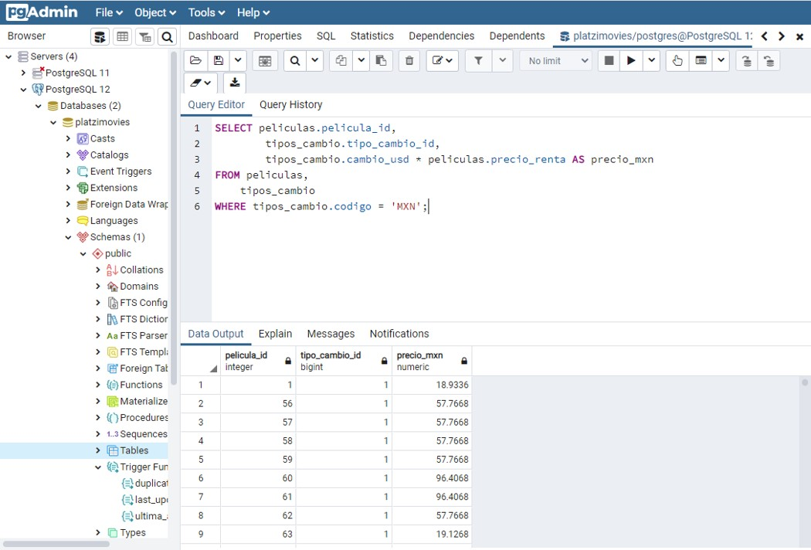

```sql
SELECT peliculas.pelicula_id,
       tipos_cambio.tipo_cambio_id,
       tipos_cambio.cambio_usd * peliculas.precio_renta AS precio_mxn
FROM peliculas,
    tipos_cambio
WHERE tipos_cambio.codigo = 'MXN';
```

Ahora creamos un Trigger usando PGAdmin para actualizar los datos en la tabla **precio_peliculas_tipo_cambio**

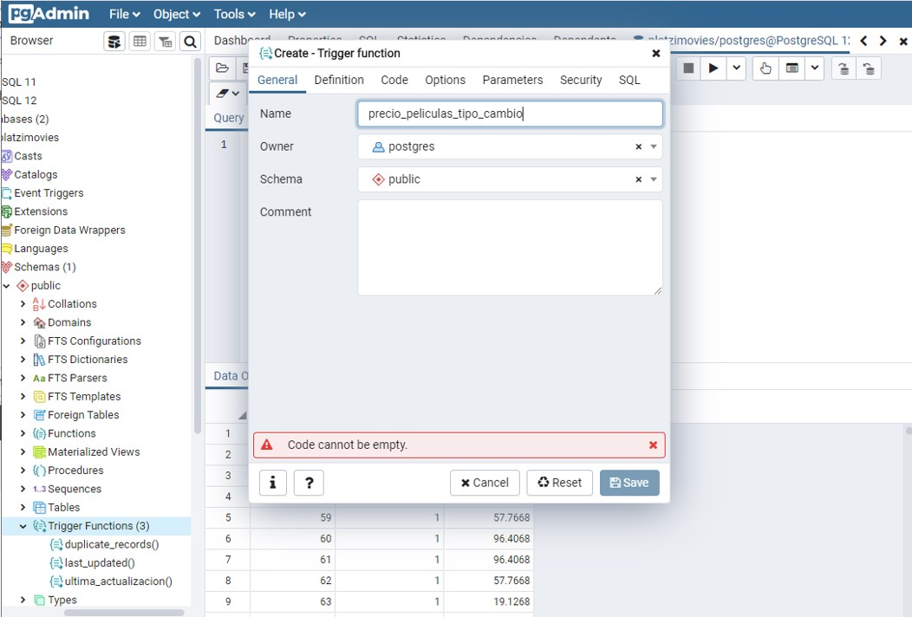

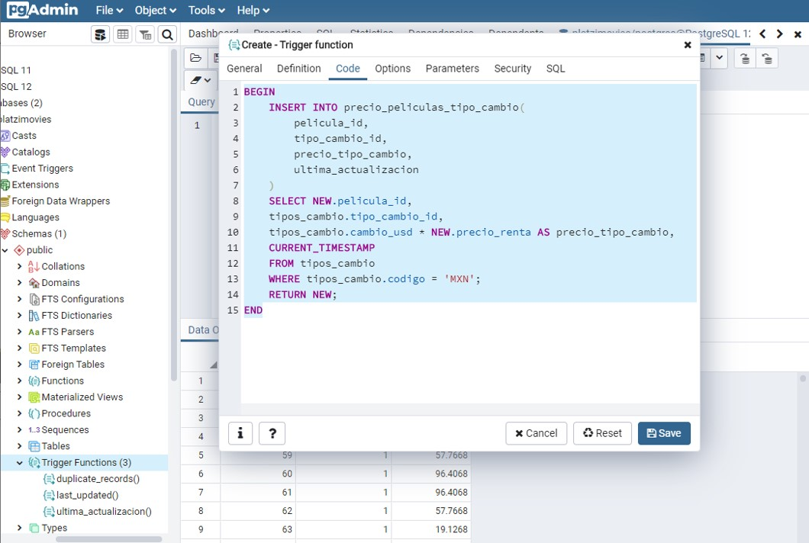

```sql
BEGIN
    INSERT INTO precio_peliculas_tipo_cambio(
        pelicula_id,
        tipo_cambio_id,
        precio_tipo_cambio,
        ultima_actualizacion
    )
    SELECT NEW.pelicula_id,
    tipos_cambio.tipo_cambio_id,
    tipos_cambio.cambio_usd * NEW.precio_renta AS precio_tipo_cambio,
    CURRENT_TIMESTAMP
    FROM tipos_cambio
    WHERE tipos_cambio.codigo = 'MXN';
    RETURN NEW;
END
```

El script creado por el sistema 

```sql
CREATE FUNCTION public.precio_peliculas_tipo_cambio()
    RETURNS trigger
    LANGUAGE 'plpgsql'
     NOT LEAKPROOF
AS $BODY$
BEGIN
    INSERT INTO precio_peliculas_tipo_cambio(
        pelicula_id,
        tipo_cambio_id,
        precio_tipo_cambio,
        ultima_actualizacion
    )
    SELECT NEW.pelicula_id,
    tipos_cambio.tipo_cambio_id,
    tipos_cambio.cambio_usd * NEW.precio_renta AS precio_tipo_cambio,
    CURRENT_TIMESTAMP
    FROM tipos_cambio
    WHERE tipos_cambio.codigo = 'MXN';
    RETURN NEW;
END
$BODY$;
```

Creamos el Trigger para hacer un insert o un update cada que la tabla peliculas sufra un cambio

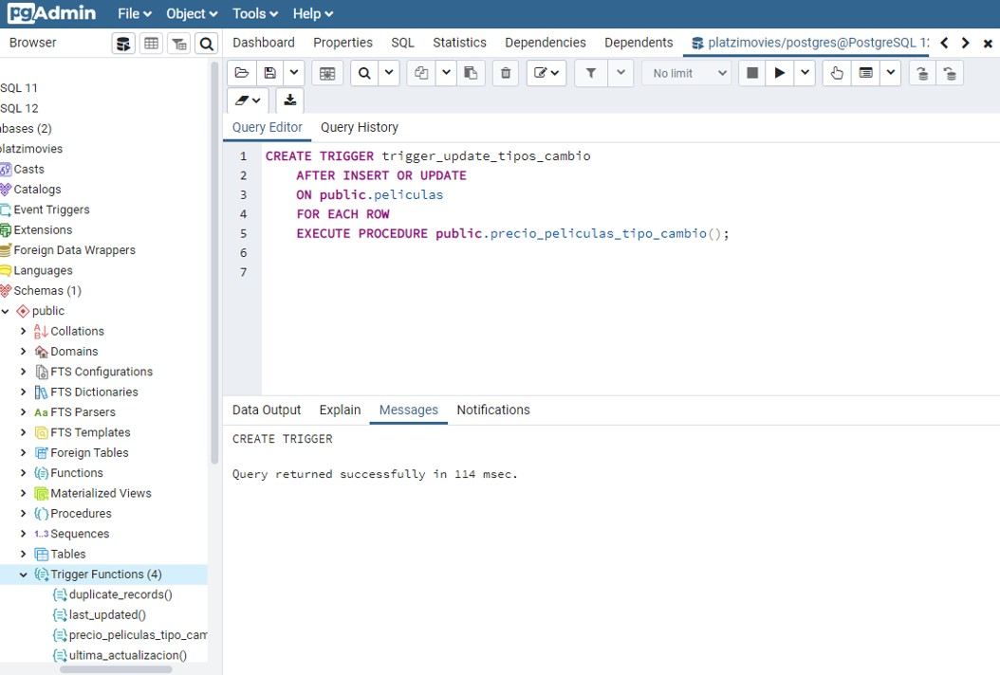

```sql
CREATE TRIGGER trigger_update_tipos_cambio
    AFTER INSERT OR UPDATE
    ON public.peliculas
    FOR EACH ROW
    EXECUTE PROCEDURE public.precio_peliculas_tipo_cambio();
```

Revisamos que nuestra tabla objetivo este vacía, o en su defecto hacemos un TRUNCATE para limpiarla.

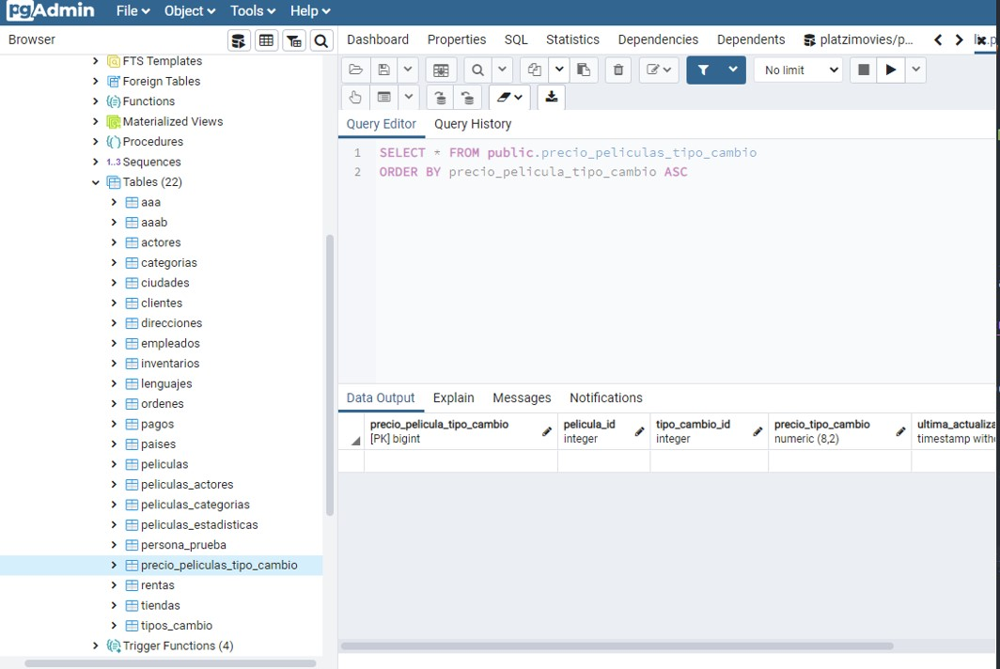

Ahora vamos a cambiar el precio de renta de un registro de 4.99 a 5.99 usando PGadmin.

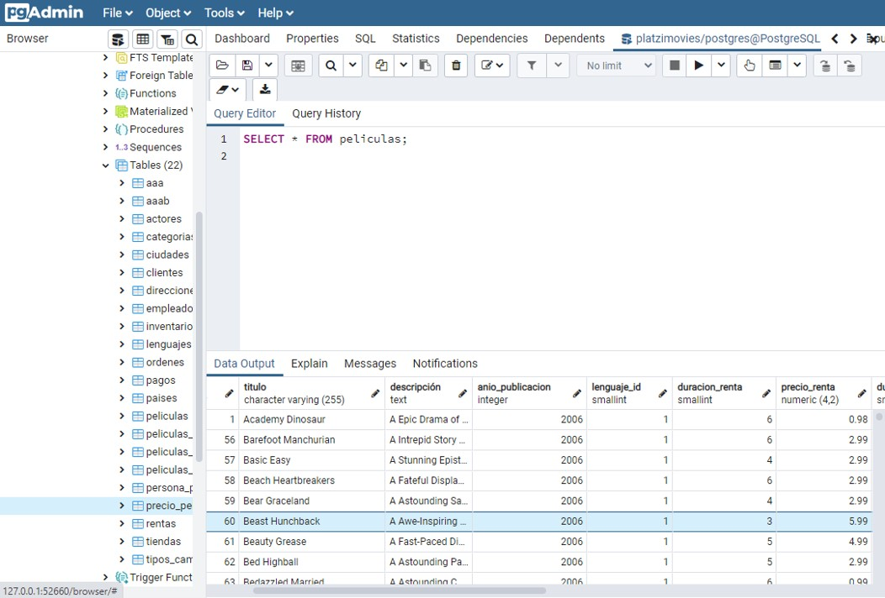


Como observas se crea un registro de forma automática en una tabla que nos permite obtener el precio en moneda local y conservar la consistencia de los datos cada que algo cambie.

### Clase 29 Usando rank y percent rank

Ya vimos como hacer un top ten utilizando window functions, como lo vimos estas nos ayudan a traer la relación entre un registro y el resto del dataset para saber que lugar ocupa o que rango ocupa.

Partimos del mismo query de la clase de top ten, en esta clase vamos a explorar rank, dense_rank y percentile_rank

```sql
SELECT
    peliculas.pelicula_id as id,
    peliculas.titulo,
    COUNT (*) AS numero_rentas,
    --WINDOW FUNCTION
    ROW_NUMBER() OVER (
       ORDER BY COUNT (*) DESC
    ) AS lugar
FROM rentas
    INNER JOIN inventarios ON rentas.inventario_id = inventarios.inventario_id
    INNER JOIN peliculas ON inventarios.pelicula_id = peliculas.pelicula_id
GROUP BY peliculas.pelicula_id
ORDER BY numero_rentas DESC
LIMIT 10;
```

#### Percentile Rank


Observamos que la unidad corresponde a la pelicula mas rentada o con una probabilidad de 1.

```sql
SELECT
    peliculas.pelicula_id as id,
    peliculas.titulo,
    COUNT (*) AS numero_rentas,
    --WINDOW FUNCTION
    PERCENT_RANK() OVER (
       ORDER BY COUNT (*) ASC
    ) AS lugar
FROM rentas
    INNER JOIN inventarios ON rentas.inventario_id = inventarios.inventario_id
    INNER JOIN peliculas ON inventarios.pelicula_id = peliculas.pelicula_id
GROUP BY peliculas.pelicula_id
ORDER BY numero_rentas DESC
;
```

#### Dense Rank

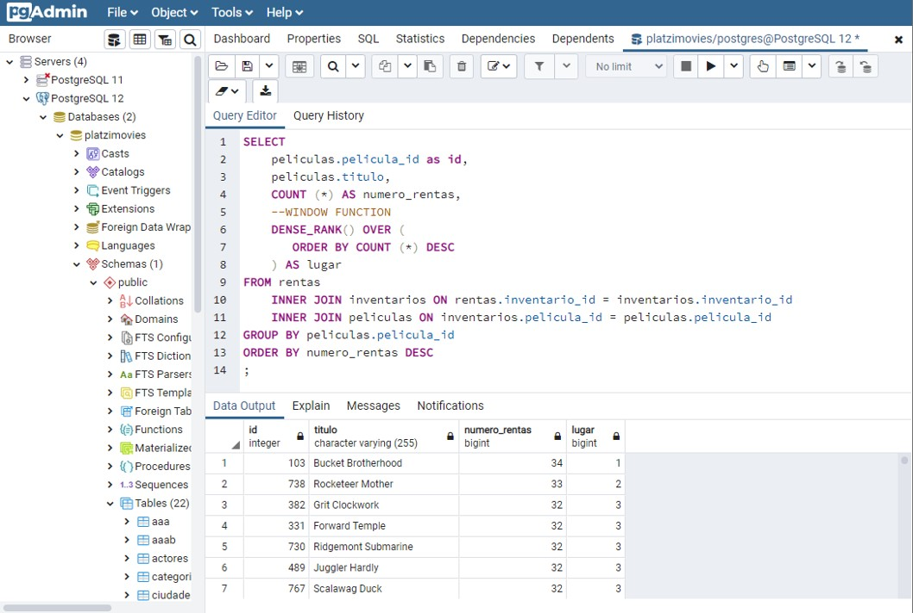

```sql
SELECT
    peliculas.pelicula_id as id,
    peliculas.titulo,
    COUNT (*) AS numero_rentas,
    --WINDOW FUNCTION
    DENSE_RANK() OVER (
       ORDER BY COUNT (*) DESC
    ) AS lugar
FROM rentas
    INNER JOIN inventarios ON rentas.inventario_id = inventarios.inventario_id
    INNER JOIN peliculas ON inventarios.pelicula_id = peliculas.pelicula_id
GROUP BY peliculas.pelicula_id
ORDER BY numero_rentas DESC
;
```

Observamos como las peliculas con 32 rentas todas comparten la posición 3 en el rango, pues no seria justo desplazarlas a números inferiores solo por su orden de aparición de id

Estas window functions nos ahorraron muchísimos cálculos matemáticos que hubiéramos tenido que hacer con sub-queries o con tablas temporales with

### Clase 30 Ordenando datos geograficos

Estos son tipos de datos que se pueden presentar en diferentes formas (latitud, longitud, códigos de países, ciudades, etc), lo acostumbrado es pintar los datos en el dashboard e integrarle color de manera visual (tipo mapas covid-19)

```sql
SELECT ciudades.ciudad_id,
        ciudades.ciudad,
        COUNT (*) AS rentas_por_ciudad
FROM ciudades
    INNER JOIN direcciones ON ciudades.ciudad_id = direcciones.ciudad_id
    INNER JOIN tiendas ON direcciones.direccion_id = tiendas.direccion_id
    INNER JOIN inventarios ON tiendas.tienda_id = inventarios.tienda_id
    INNER JOIN rentas ON inventarios.inventario_id = rentas.inventario_id
GROUP BY ciudades.ciudad_id;
```

Nota. Esperaba mas de esta clase...

### Clase 31 Datos en el tiempo

Una linea de tiempo es importante para encontrar Picos de eventos, tendencias las cuales pueden ser positivas o negativas.

Vamos a hacer un query relacionado con una linea de tiempo utilizando la funcion **date_part**.

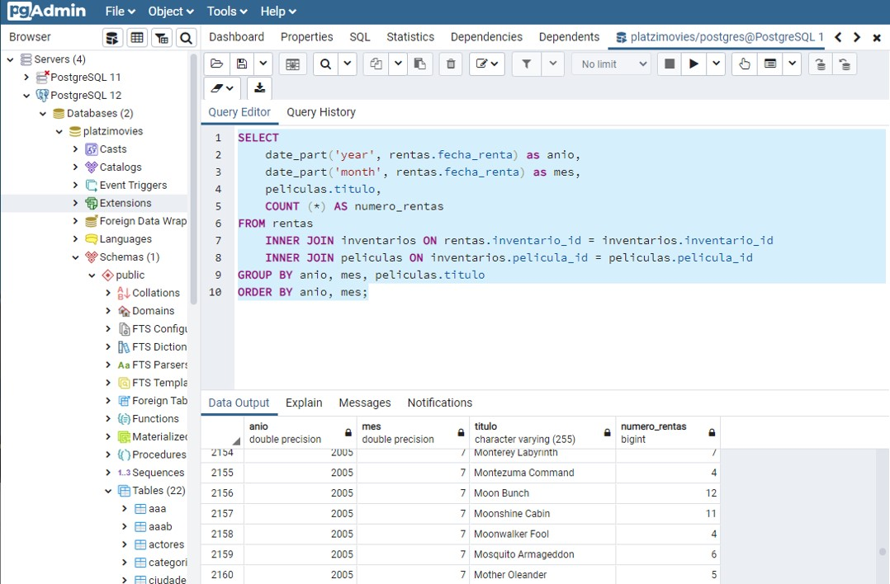

```sql
SELECT 
    date_part('year', rentas.fecha_renta) as anio,
    date_part('month', rentas.fecha_renta) as mes,
    peliculas.titulo,
    COUNT (*) AS numero_rentas
FROM rentas
    INNER JOIN inventarios ON rentas.inventario_id = inventarios.inventario_id
    INNER JOIN peliculas ON inventarios.pelicula_id = peliculas.pelicula_id
GROUP BY anio, mes, peliculas.titulo
ORDER BY anio, mes;
```

Otra vista de ejemplo

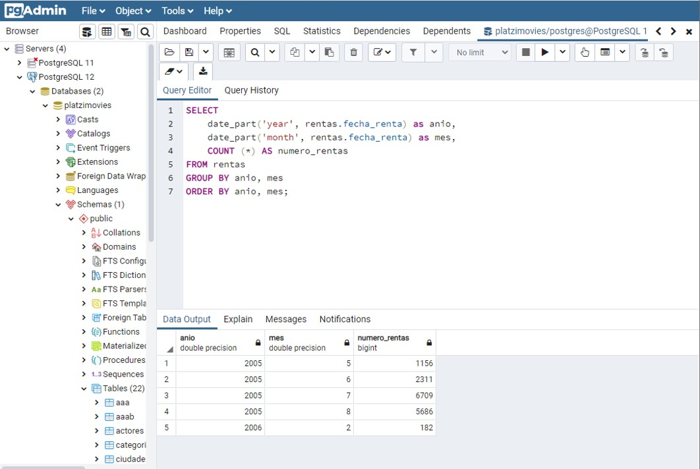

```sql
SELECT
    date_part('year', rentas.fecha_renta) as anio,
    date_part('month', rentas.fecha_renta) as mes,
    COUNT (*) AS numero_rentas
FROM rentas
GROUP BY anio, mes
ORDER BY anio, mes;
```

### Clase 32 Visualizando datos con Tableau

Esta clase solo muestra un dashboard construido con tableu, no se utiliza la herramienta solo se visualizan los datos

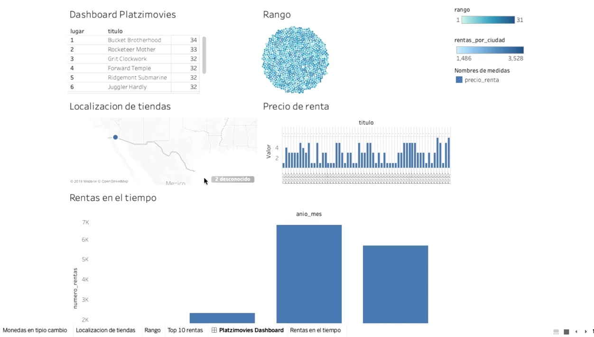

Otros recursos de interes en platzi

* [Curso de Introducción a Business Intelligence con Power BI](https://platzi.com/clases/business-intelligence/)

- [Curso de Google Data Studio](https://platzi.com/clases/data-studio/)

## Modulo 6 Siguientes pasos

### Clase 33 Que sigue

Esta es una gran herramienta (de muchas), podemos hacer muchas cosas, pero tambien existen herramientas de visualizacion de datos, de data wherehousing, machine learning, etc.

